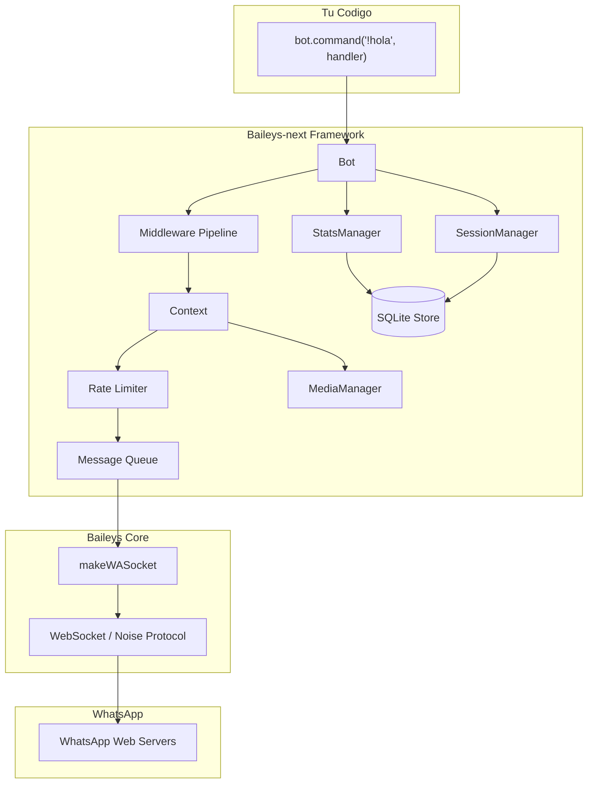
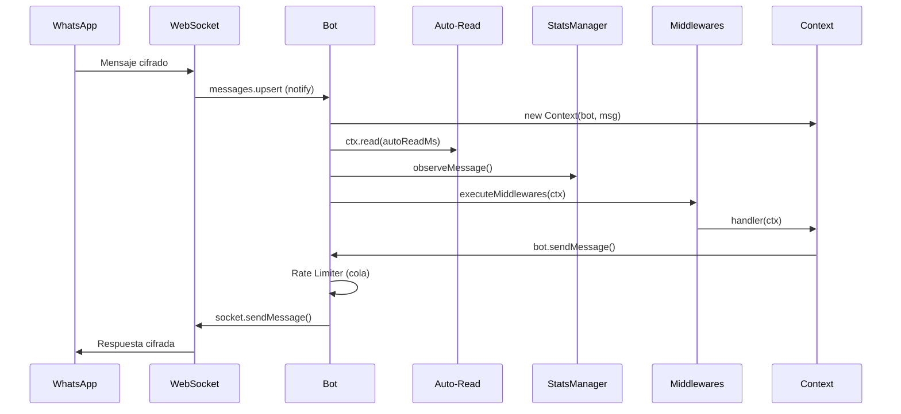
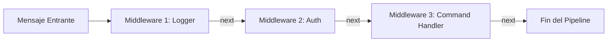
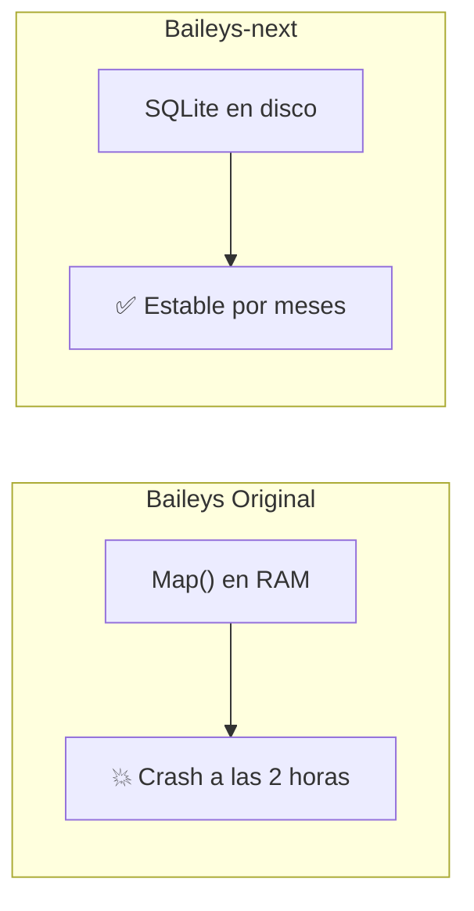
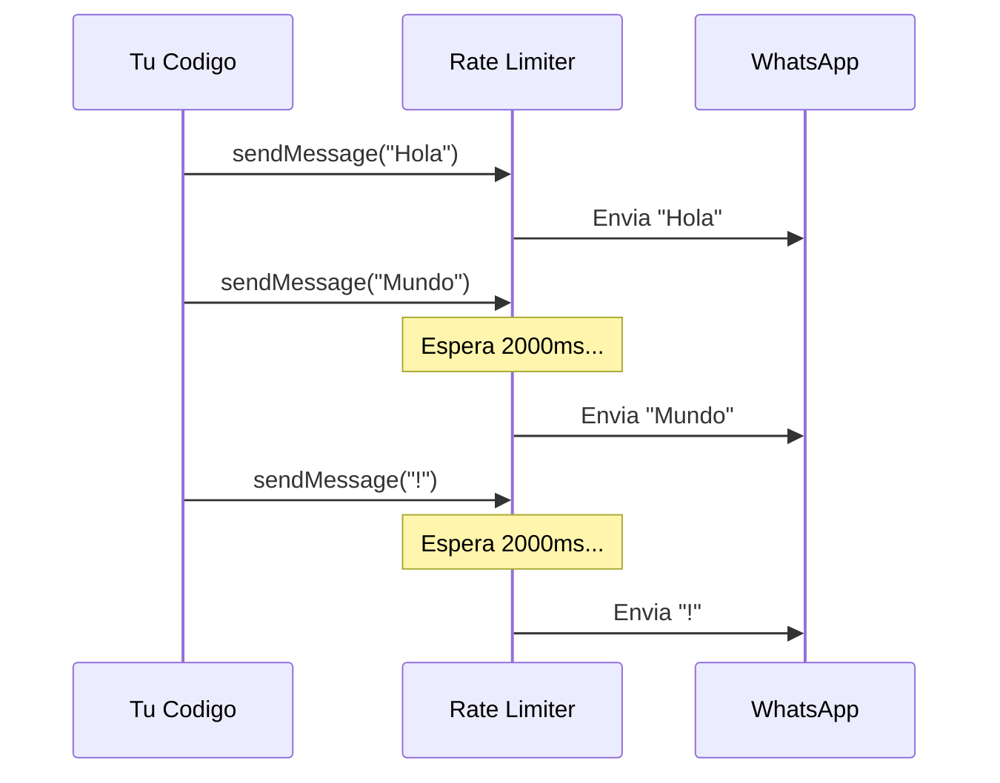
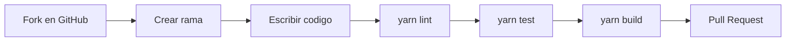

<h1 align="center">
  
  <br/>
  Baileys-next
</h1>

<p align="center">
  <b>La libreria de WhatsApp Web para Node.js, reimaginada para produccion.</b>
  <br/>
  Fork de alto rendimiento de <a href="https://github.com/WhiskeySockets/Baileys">WhiskeySockets/Baileys</a> con persistencia SQLite, Rate Limiter, Multimedia automatica y Analiticas de grupo.
</p>

<p align="center">
  <a href="#-instalacion"></a>
  <a href="https://github.com/LuferOS/Baileys-next/blob/master/LICENSE"></a>
  <a href="https://github.com/LuferOS/Baileys-next"></a>
</p>

---

## Tabla de Contenidos

- [Por que Baileys-next](#-por-que-baileys-next)
- [Arquitectura](#-arquitectura)
- [Instalacion](#-instalacion)
- [Guia Rapida](#-guia-rapida)
- [Referencia de la API](#-referencia-de-la-api)
  - [BotConfig](#botconfig)
  - [Clase Bot](#clase-bot)
  - [Clase Context](#clase-context-ctx)
  - [StatsManager](#statsmanager)
  - [SessionManager](#sessionmanager)
  - [MediaManager](#mediamanager)
- [Middlewares](#-middlewares)
- [Persistencia SQLite](#-persistencia-sqlite)
- [Rate Limiter y Anti-Ban](#-rate-limiter-y-anti-ban)
- [Analiticas y Fantasmas](#-analiticas-y-fantasmas)
- [Multimedia (Stickers y Notas de Voz)](#-multimedia-stickers-y-notas-de-voz)
- [Acceso a Bajo Nivel](#-acceso-a-bajo-nivel)
- [Evitar Problemas Comunes](#-evitar-problemas-comunes)
- [Migracion desde Baileys Original](#-migracion-desde-baileys-original)
- [Contribuir](#-contribuir)
- [Creditos y Reconocimientos](#-creditos-y-reconocimientos)
- [Aviso Legal](#-aviso-legal)

---

## 🚀 Por que Baileys-next

La libreria original de Baileys es un motor brillante, pero fue disenada como una capa de bajo nivel. Cuando miles de desarrolladores la usaron para construir bots de produccion, aparecieron problemas repetidos:

| Problema | Baileys Original | Baileys-next |
|---|---|---|
| Consumo de RAM | Crece sin limite (in-memory store) | Constante (~15 MB) gracias a SQLite en disco |
| Desconexiones | El desarrollador debe manejar la reconexion | Exponential Backoff automatico integrado |
| Envio masivo | Sin proteccion, alto riesgo de ban | Rate Limiter con cola inteligente |
| Multimedia | Requiere FFmpeg manual en el sistema | `ffmpeg-static` incluido, 0 instalacion extra |
| Analiticas de grupo | No existe | StatsManager con deteccion de "fantasmas" |
| Experiencia de desarrollo | Callbacks y eventos crudos | API de alto nivel con `Bot`, `Context` y Middlewares |

---

## 🏗 Arquitectura



**Flujo de un mensaje entrante:**



---

## 📦 Instalacion

### Desde GitHub (recomendado)
```bash
npm install github:LuferOS/Baileys-next
```

### Desde NPM (proximamente)
```bash
npm install baileys-next
```

### Requisitos
- **Node.js** >= 20 (recomendado: v20 LTS o v22 LTS)
- **Sistema operativo**: Windows, macOS, Linux
- **No se necesita** instalar FFmpeg manualmente (incluido via `ffmpeg-static`)

> **Nota sobre Node.js v24+:** La version bleeding-edge de Node puede causar fallos al compilar `better-sqlite3`. Si tienes problemas, usa Node 22 LTS con `nvm use 22`.

---

## ⚡ Guia Rapida

### Ejemplo Minimo

```typescript
import { Bot, useMultiFileAuthState } from 'baileys-next'

async function main() {
    const { state, saveCreds } = await useMultiFileAuthState('auth_session')

    const bot = new Bot({
        auth: state,
        printQRInTerminal: true
    })

    bot.command('!ping', async (ctx) => {
        await ctx.reply({ text: 'Pong! 🏓' })
    })

    bot.socket?.ev.on('creds.update', saveCreds)
    await bot.start()
}

main()
```

### Ejemplo Completo (Produccion)

```typescript
import { Bot, useMultiFileAuthState } from 'baileys-next'

async function main() {
    const { state, saveCreds } = await useMultiFileAuthState('auth_session')

    const bot = new Bot({
        auth: state,
        printQRInTerminal: true,
        // === Escudos Anti-Ban ===
        rateLimitMs: 1500,   // 1.5 segundos entre cada mensaje enviado
        autoReadMs: 2000,    // Marca como "leido" 2 segundos despues de recibir
        // === Analiticas ===
        enableStats: true    // Activar rastreo de actividad por grupo
    })

    // --- Middleware global: Logger ---
    bot.use(async (ctx, next) => {
        console.log(`[${new Date().toISOString()}] Mensaje de: ${ctx.remoteJid}`)
        await next()
    })

    // --- Comandos ---
    bot.command('!ping', async (ctx) => {
        await ctx.reply({ text: 'Pong! 🏓' })
    })

    bot.command('!sticker', async (ctx) => {
        const quoted = ctx.message.message?.imageMessage
        if (!quoted) {
            await ctx.reply({ text: 'Responde a una imagen con !sticker' })
            return
        }
        // La libreria convierte la imagen a WebP automaticamente
        // await ctx.replySticker(imageBuffer, { packname: 'MiBot', author: '@luis' })
    })

    bot.command('!fantasmas', async (ctx) => {
        if (!bot.stats) return
        const ghosts = await bot.stats.getGhosts(ctx.remoteJid, 30)
        const total = ghosts.filter(g => g.isTotalGhost).length
        const inactive = ghosts.filter(g => !g.isTotalGhost).length
        await ctx.reply({
            text: `👻 Fantasmas del grupo:\n` +
                  `- Nunca han hablado: ${total}\n` +
                  `- Inactivos (30 dias): ${inactive}\n` +
                  `- Total: ${ghosts.length}`
        })
    })

    bot.command('!top', async (ctx) => {
        if (!bot.stats) return
        const top = bot.stats.getTopUsers(ctx.remoteJid, 5)
        const lines = top.map((u, i) => `${i + 1}. @${u.userJid.split('@')[0]} — ${u.messageCount} msgs`)
        await ctx.reply({
            text: `🏆 Top 5 mas activos:\n${lines.join('\n')}`,
            mentions: top.map(u => u.userJid)
        })
    })

    bot.command('!react', async (ctx) => {
        await ctx.react('❤️')
    })

    // --- Estado por chat (Session) ---
    bot.command('!recordar', async (ctx) => {
        const args = ctx.text?.replace('!recordar ', '') || ''
        ctx.session.set({ nota: args })
        await ctx.reply({ text: `📝 Guardado: "${args}"` })
    })

    bot.command('!nota', async (ctx) => {
        const data = ctx.session.get<{ nota: string }>()
        await ctx.reply({ text: data?.nota ? `📝 Tu nota: "${data.nota}"` : 'No tienes notas.' })
    })

    // --- Escuchar todos los textos ---
    bot.onText(async (ctx, next) => {
        // Este handler se ejecuta para TODOS los mensajes de texto
        // Util para anti-spam, logs, etc.
        await next()
    })

    // --- Guardar credenciales ---
    bot.socket?.ev.on('creds.update', saveCreds)
    await bot.start()
}

main()
```

---

## 📖 Referencia de la API

### BotConfig

Extiende `UserFacingSocketConfig` de Baileys (todas las opciones originales siguen funcionando).

| Opcion | Tipo | Default | Descripcion |
|---|---|---|---|
| `auth` | `AuthenticationState` | **requerido** | Estado de autenticacion (de `useMultiFileAuthState`) |
| `printQRInTerminal` | `boolean` | `false` | Muestra el codigo QR en la terminal |
| `enableStats` | `boolean` | `true` | Activa el `StatsManager` para analiticas de grupo |
| `rateLimitMs` | `number` | `undefined` | Milisegundos de pausa entre cada mensaje enviado. Si es `undefined` o `0`, no se aplica limite |
| `autoReadMs` | `number` | `undefined` | Milisegundos de retardo antes de marcar mensajes como "leidos". Si es `undefined`, no se auto-lee |
| `browser` | `[string, string, string]` | `['Mac OS', 'Chrome', '121']` | Identidad del navegador para la conexion |

---

### Clase Bot

La clase principal. Orquesta el socket, los middlewares, la base de datos y todas las funciones.

```typescript
const bot = new Bot(config: BotConfig)
```

| Metodo / Propiedad | Retorno | Descripcion |
|---|---|---|
| `bot.start()` | `Promise<void>` | Conecta al WebSocket de WhatsApp y comienza a escuchar |
| `bot.command(cmd, handler)` | `void` | Registra un handler que se activa cuando un mensaje empieza con `cmd` |
| `bot.onText(handler)` | `void` | Registra un handler para todos los mensajes de texto |
| `bot.use(middleware)` | `void` | Registra un middleware (ver seccion Middlewares) |
| `bot.sendMessage(jid, content, opts?)` | `Promise<any>` | Envia un mensaje (pasa por Rate Limiter si esta activo) |
| `bot.socket` | `WASocket \| undefined` | Acceso directo al socket de Baileys (bajo nivel) |
| `bot.store` | `SQLiteStore` | Instancia de la base de datos SQLite |
| `bot.stats` | `StatsManager \| undefined` | Instancia del gestor de analiticas (si `enableStats` es true) |
| `bot.session` | `SessionManager` | Gestor de sesiones persistentes por chat |
| `bot.isConnected` | `boolean` | Estado actual de la conexion |

---

### Clase Context (`ctx`)

Envuelve cada mensaje entrante con metodos convenientes. Se pasa como primer argumento a cada handler y middleware.

```typescript
bot.command('!test', async (ctx: Context) => { ... })
```

| Metodo / Propiedad | Retorno | Descripcion |
|---|---|---|
| `ctx.message` | `WAMessage` | El mensaje crudo original de WhatsApp |
| `ctx.remoteJid` | `string` | El JID del chat (grupo o privado) |
| `ctx.text` | `string \| undefined` | Texto del mensaje (extrae de `conversation` o `extendedTextMessage`) |
| `ctx.bot` | `Bot` | Referencia al Bot padre |
| `ctx.reply(content, opts?)` | `Promise<any>` | Responde al mensaje (con quote automatico) |
| `ctx.react(emoji)` | `Promise<any>` | Reacciona al mensaje con un emoji |
| `ctx.replySticker(buffer, meta?)` | `Promise<any>` | Convierte imagen/video a WebP y lo envia como sticker |
| `ctx.replyVoiceNote(buffer)` | `Promise<any>` | Convierte audio a Opus/OGG y lo envia como nota de voz |
| `ctx.read(delayMs?)` | `Promise<any>` | Marca el mensaje como leido, con un retardo opcional |
| `ctx.session.get<T>()` | `T \| null` | Obtiene los datos de sesion del chat actual |
| `ctx.session.set(data)` | `void` | Guarda datos de sesion para el chat actual |
| `ctx.session.update(data)` | `void` | Actualiza (merge) los datos de sesion |
| `ctx.session.delete()` | `void` | Elimina la sesion del chat actual |

---

### StatsManager

Motor de analiticas silencioso. Almacena estadisticas de actividad en SQLite.

| Metodo | Retorno | Descripcion |
|---|---|---|
| `stats.getTopUsers(groupJid, limit?)` | `UserStats[]` | Los `limit` usuarios mas activos de un grupo |
| `stats.getTopStickers(groupJid, limit?)` | `UserStats[]` | Los `limit` usuarios que mas stickers envian |
| `stats.getGhosts(groupJid, inactiveDays?)` | `Promise<Ghost[]>` | Miembros que no han hablado en `inactiveDays` dias |
| `stats.observeMessage(groupJid, userJid, isSticker)` | `void` | Registra un mensaje (se llama automaticamente) |

**Interfaces:**
```typescript
interface UserStats {
    userJid: string
    messageCount: number
    stickerCount: number
    lastActive: number // timestamp
}

interface Ghost {
    jid: string
    isTotalGhost: boolean  // true = nunca ha enviado un mensaje
    lastActive?: number    // timestamp de su ultimo mensaje
}
```

---

### SessionManager

Almacena datos arbitrarios por chat (util para flujos multi-paso, estados de conversacion, etc).

| Metodo | Retorno | Descripcion |
|---|---|---|
| `session.get<T>(jid)` | `T \| null` | Obtiene los datos serializados de una sesion |
| `session.set(jid, data)` | `void` | Guarda datos serializados (reemplaza todo) |
| `session.update(jid, data)` | `void` | Hace merge parcial de datos |
| `session.delete(jid)` | `void` | Elimina la sesion |

---

### MediaManager

Utilidad estatica para conversion de multimedia. No requiere instanciacion.

| Metodo | Retorno | Descripcion |
|---|---|---|
| `MediaManager.convertToSticker(input, meta?)` | `Promise<Buffer>` | Convierte imagen o video a WebP (512x512) con metadatos EXIF |
| `MediaManager.convertToVoiceNote(input)` | `Promise<Buffer>` | Convierte audio a Opus/OGG compatible con WhatsApp PTT |

**StickerMetadata:**
```typescript
interface StickerMetadata {
    packname?: string  // Nombre del paquete de stickers
    author?: string    // Nombre del autor
}
```

---

## 🔗 Middlewares

Baileys-next usa un pipeline de middlewares inspirado en Koa/Express. Cada middleware recibe `ctx` y una funcion `next()` que ejecuta el siguiente middleware en la cadena.



### Ejemplo: Logger + Filtro de Admin

```typescript
// 1. Logger global (se ejecuta siempre)
bot.use(async (ctx, next) => {
    const start = Date.now()
    await next()
    const ms = Date.now() - start
    console.log(`[${ms}ms] ${ctx.remoteJid}: ${ctx.text}`)
})

// 2. Filtro: Solo permitir admins en ciertos comandos
bot.use(async (ctx, next) => {
    if (ctx.text?.startsWith('!admin')) {
        const admins = ['5491100000000@s.whatsapp.net']
        const sender = ctx.message.key.participant || ctx.message.key.remoteJid || ''
        if (!admins.includes(sender)) {
            await ctx.reply({ text: '⛔ No tienes permisos.' })
            return // NO llama a next(), bloquea la cadena
        }
    }
    await next()
})

// 3. Comando protegido (solo llega si el middleware 2 llamo a next)
bot.command('!admin kick', async (ctx) => {
    // Solo admins llegan aqui
})
```

> **Regla de oro:** Si no llamas a `await next()`, la cadena se detiene. Usa esto para filtros de permisos, anti-spam, etc.

---

## 💾 Persistencia SQLite

Baileys-next reemplaza el almacenamiento en memoria por una base de datos SQLite de alta velocidad.



### Que se almacena

| Tabla | Proposito |
|---|---|
| `msg_retry_count` | Contador de reintentos de mensajes (reemplaza `msgRetryCounterCache`) |
| `sessions` | Datos de sesion arbitrarios por chat (`SessionManager`) |
| `group_stats` | Contadores de mensajes, stickers y timestamp de actividad (`StatsManager`) |

### Ubicacion

Por defecto, la base de datos se crea en `./baileys_store.db` en el directorio de trabajo. El archivo es portable — puedes moverlo entre servidores para conservar todas tus sesiones y estadisticas.

---

## 🛡 Rate Limiter y Anti-Ban

WhatsApp detecta automatismos por patrones como: envio instantaneo de muchos mensajes, lectura instantanea sin retardo humano, y sesiones con identidades sospechosas.

Baileys-next incluye dos escudos integrados que el desarrollador solo tiene que activar:

### Rate Limiter (`rateLimitMs`)

```typescript
const bot = new Bot({
    auth: state,
    rateLimitMs: 2000 // 2 segundos entre cada mensaje
})
```

**Funcionamiento interno:**



Sin importar cuantos `sendMessage()` lance tu codigo, la libreria los despacha uno a uno con la pausa configurada. Esto simula el ritmo de un humano escribiendo.

### Auto-Read (`autoReadMs`)

```typescript
const bot = new Bot({
    auth: state,
    autoReadMs: 3000 // Marca como "leido" 3 segundos despues de recibir
})
```

WhatsApp sospecha cuando un bot marca mensajes como leidos en 0 milisegundos. Con `autoReadMs`, la libreria clava el "visto" despues de un retardo natural, simulando a un humano leyendo el celular.

Tambien puedes marcar como leido manualmente desde un handler:
```typescript
bot.command('!test', async (ctx) => {
    await ctx.read(1500) // Marca como leido con 1.5s de retardo
    await ctx.reply({ text: 'Listo!' })
})
```

### Mejores Practicas Anti-Ban

| Practica | Configuracion Recomendada |
|---|---|
| Bot personal / uso privado | `rateLimitMs: 500` |
| Bot de grupo (< 50 grupos) | `rateLimitMs: 1500` |
| Bot de servicio (100+ grupos) | `rateLimitMs: 2000 - 3000` |
| Siempre activar auto-read | `autoReadMs: 1000 - 3000` |

---

## 👻 Analiticas y Fantasmas

El `StatsManager` registra cada mensaje que pasa por la libreria y almacena los contadores en SQLite. Todo ocurre en segundo plano, sin impacto en el rendimiento.

### Detectar Fantasmas

```typescript
bot.command('!fantasmas', async (ctx) => {
    const ghosts = await bot.stats.getGhosts(ctx.remoteJid, 30) // 30 dias

    // isTotalGhost = true -> Nunca ha enviado ni un mensaje
    // isTotalGhost = false -> Antes hablaba, ahora no
    const totales = ghosts.filter(g => g.isTotalGhost).length
    const inactivos = ghosts.filter(g => !g.isTotalGhost).length

    await ctx.reply({
        text: `👻 ${totales} fantasmas totales, ${inactivos} inactivos recientes.`
    })
})
```

### Ranking de Actividad

```typescript
bot.command('!top', async (ctx) => {
    const top = bot.stats.getTopUsers(ctx.remoteJid, 10)
    // Retorna: [{ userJid, messageCount, stickerCount, lastActive }]
})

bot.command('!topstickers', async (ctx) => {
    const top = bot.stats.getTopStickers(ctx.remoteJid, 10)
    // Los que mas stickers envian
})
```

---

## 🎨 Multimedia (Stickers y Notas de Voz)

### Crear Stickers

```typescript
// Desde un buffer de imagen
await ctx.replySticker(imageBuffer, {
    packname: 'MiBot',
    author: '@usuario'
})

// Desde una ruta de archivo
await ctx.replySticker('/tmp/imagen.png')
```

La libreria automaticamente:
1. Redimensiona la imagen a 512x512 px
2. Convierte a formato WebP
3. Inyecta metadatos EXIF (packname, author) para que aparezca en el explorador de stickers

### Crear Notas de Voz

```typescript
// Convierte cualquier audio a formato PTT nativo de WhatsApp
await ctx.replyVoiceNote(audioBuffer)
await ctx.replyVoiceNote('/tmp/cancion.mp3')
```

La libreria convierte automaticamente a Opus/OGG y lo envia como PTT (Push To Talk), que es el formato nativo de las notas de voz de WhatsApp.

---

## 🔧 Acceso a Bajo Nivel

Baileys-next **no reemplaza** a Baileys — lo extiende. El socket original esta siempre disponible:

```typescript
// Acceso directo al socket de Baileys
const socket = bot.socket

// Todas las funciones originales siguen disponibles:
await socket.sendPresenceUpdate('composing', jid)
await socket.profilePictureUrl(jid)
await socket.groupMetadata(groupJid)
await socket.updateProfilePicture(jid, buffer)

// Eventos originales
socket.ev.on('group-participants.update', handler)
socket.ev.on('presence.update', handler)
```

---

## ⚠️ Evitar Problemas Comunes

### 1. Error: `better-sqlite3` no compila

**Causa:** Node.js v24+ tiene cambios en el compilador C++ que rompen la compilacion nativa.

**Solucion:**
```bash
# Opcion A: Usar Node.js 22 LTS (recomendado)
nvm install 22
nvm use 22

# Opcion B: Forzar la instalacion (solo si tienes VS Build Tools)
npm install --build-from-source
```

### 2. Error: `ECONNRESET` o desconexiones frecuentes

**Causa:** Red inestable o multiples sesiones activas.

**Solucion:** No hagas nada. Baileys-next tiene Exponential Backoff integrado. Se reconectara automaticamente con delays de 2s, 4s, 8s, 16s... hasta un maximo de 60s.

### 3. Error: `LoggedOut` (codigo 401)

**Causa:** WhatsApp cerro tu sesion (otro dispositivo, ban, etc).

**Solucion:** Elimina la carpeta de autenticacion y vuelve a escanear el QR:
```bash
rm -rf auth_session/
node bot.js
```

### 4. Los stickers no se ven en iOS

**Causa:** La imagen excede los 100 KB despues de la conversion.

**Solucion:** La libreria ya comprime a 512x512, pero si el video es muy largo, recortalo antes de pasar el buffer.

### 5. Los mensajes se envian fuera de orden

**Causa:** No estas usando el Rate Limiter.

**Solucion:** Activa `rateLimitMs` para garantizar que los mensajes salgan en el orden correcto:
```typescript
const bot = new Bot({ auth: state, rateLimitMs: 1000 })
```

---

## 🔄 Migracion desde Baileys Original

Si tienes un bot que usa Baileys original (`@whiskeysockets/baileys`), aqui estan los pasos para migrar:

### Paso 1: Cambiar la dependencia

```bash
# Eliminar la version original
npm uninstall @whiskeysockets/baileys

# Instalar el fork
npm install github:LuferOS/Baileys-next
```

### Paso 2: Actualizar los imports

```diff
- import makeWASocket from '@whiskeysockets/baileys'
+ import { Bot, useMultiFileAuthState } from 'baileys-next'
```

### Paso 3: Reemplazar el patron de socket crudo

```diff
- const sock = makeWASocket({ auth: state })
- sock.ev.on('messages.upsert', ({ messages }) => {
-     for (const msg of messages) {
-         if (msg.message?.conversation === '!ping') {
-             sock.sendMessage(msg.key.remoteJid, { text: 'Pong!' })
-         }
-     }
- })

+ const bot = new Bot({ auth: state })
+ bot.command('!ping', async (ctx) => {
+     await ctx.reply({ text: 'Pong!' })
+ })
+ await bot.start()
```

### Paso 4 (opcional): Eliminar `makeInMemoryStore`

Si usabas `makeInMemoryStore`, ya no lo necesitas. `SQLiteStore` lo reemplaza completamente y la libreria lo conecta de forma automatica.

```diff
- import { makeInMemoryStore } from '@whiskeysockets/baileys'
- const store = makeInMemoryStore({})
- store.bind(sock.ev)
// Ya no es necesario, SQLiteStore se inicializa automaticamente
```

> **Compatibilidad hacia atras:** Si tu codigo usa `bot.socket` para llamar funciones originales de Baileys, seguiran funcionando sin cambios. Solo la capa de alto nivel es nueva.

---

## 🤝 Contribuir

### Requisitos

1. **Node.js** >= 20
2. **Corepack** habilitado (`corepack enable`)
3. Clonar el repositorio:
```bash
git clone https://github.com/LuferOS/Baileys-next.git
cd Baileys-next
yarn install
```

### Estructura del Proyecto

```
src/
├── Framework/           ← Codigo de alto nivel (este fork)
│   ├── Bot.ts           ← Clase principal, middlewares, rate limiter
│   ├── Context.ts       ← Wrapper de mensaje con metodos helper
│   ├── MediaManager.ts  ← Conversion de stickers y notas de voz
│   ├── SessionManager.ts← Sesiones persistentes por chat
│   ├── StatsManager.ts  ← Analiticas y deteccion de fantasmas
│   ├── Store/
│   │   └── SQLiteStore.ts ← Motor de persistencia SQLite
│   └── index.ts         ← Re-exports del framework
├── Socket/              ← Core de Baileys (no modificar sin razon)
├── Signal/              ← Protocolo Signal (criptografia)
├── Utils/               ← Utilidades del core
├── Types/               ← Tipos TypeScript publicos
├── WABinary/            ← Codificacion binaria
└── index.ts             ← Export principal
```

### Flujo de Trabajo



1. Haz **Fork** del repositorio
2. Crea una rama descriptiva: `git checkout -b feat/nueva-funcionalidad`
3. Escribe tu codigo siguiendo el estilo existente:
   - Tabs para indentacion
   - Comillas simples
   - Sin punto y coma
   - `import type` para tipos que no se usan en runtime
4. Ejecuta las validaciones:
   ```bash
   yarn lint      # TypeScript + ESLint (0 errores)
   yarn test      # Tests unitarios
   yarn build     # Compilacion limpia
   ```
5. Haz commit con [Conventional Commits](https://www.conventionalcommits.org/):
   ```bash
   git commit -m "feat(framework): add cooldown per user"
   git commit -m "fix(media): handle webp conversion on linux"
   ```
6. Abre un **Pull Request** hacia la rama `master`

### Que SI contribuir

- Nuevas funciones para el Framework (con tests)
- Mejoras de rendimiento
- Correccion de bugs
- Documentacion y ejemplos
- Traducciones del README

### Que NO contribuir

- Herramientas de spam o mensajeria masiva no solicitada
- Scrapers de datos personales sin consentimiento
- Mecanismos para evadir bans legitimos de WhatsApp
- Cambios al core de Baileys sin justificacion de protocolo

---

## 💖 Creditos y Reconocimientos

Este proyecto es un **Fork** construido sobre los hombros de gigantes. Todo el merito de la ingenieria de red (Noise Protocol, WebSockets y criptografia Signal) pertenece a la comunidad original:

| Contribuidor | Rol |
|---|---|
| **WhiskeySockets / Rajeh** | Creadores y mantenedores actuales del core original |
| **@pokearaujo** | Observaciones criticas sobre WhatsApp Multi-Device |
| **@Sigalor** | Ingenieria inversa del protocolo original de WA Web |
| **@Rhymen** | Primera implementacion en Go que inspiro el proyecto |

Si tu empresa depende del nucleo de Baileys y deseas apoyar al mantenedor original, puedes hacerlo en su [Sponsor Page](https://purpshell.dev/sponsor).

---

## ⚖️ Aviso Legal

*Este proyecto NO esta afiliado, asociado, autorizado, respaldado por, ni conectado de ninguna manera oficial con WhatsApp o cualquiera de sus filiales. "WhatsApp" y las marcas relacionadas son marcas registradas de sus respectivos duenos.*

*Los mantenedores de este Fork no aprueban en modo alguno el uso de esta aplicacion en practicas que violen los Terminos de Servicio de WhatsApp (tales como spam, mensajeria masiva automatizada no deseada o extraccion de datos sin consentimiento). Se apela a la responsabilidad personal de sus usuarios para usar esta libreria de forma etica y legitima.*

---

<p align="center">
  <sub>Hecho con ❤️ por <a href="https://github.com/LuferOS">LuferOS</a> — Powered by <a href="https://github.com/WhiskeySockets/Baileys">Baileys</a></sub>
</p>
